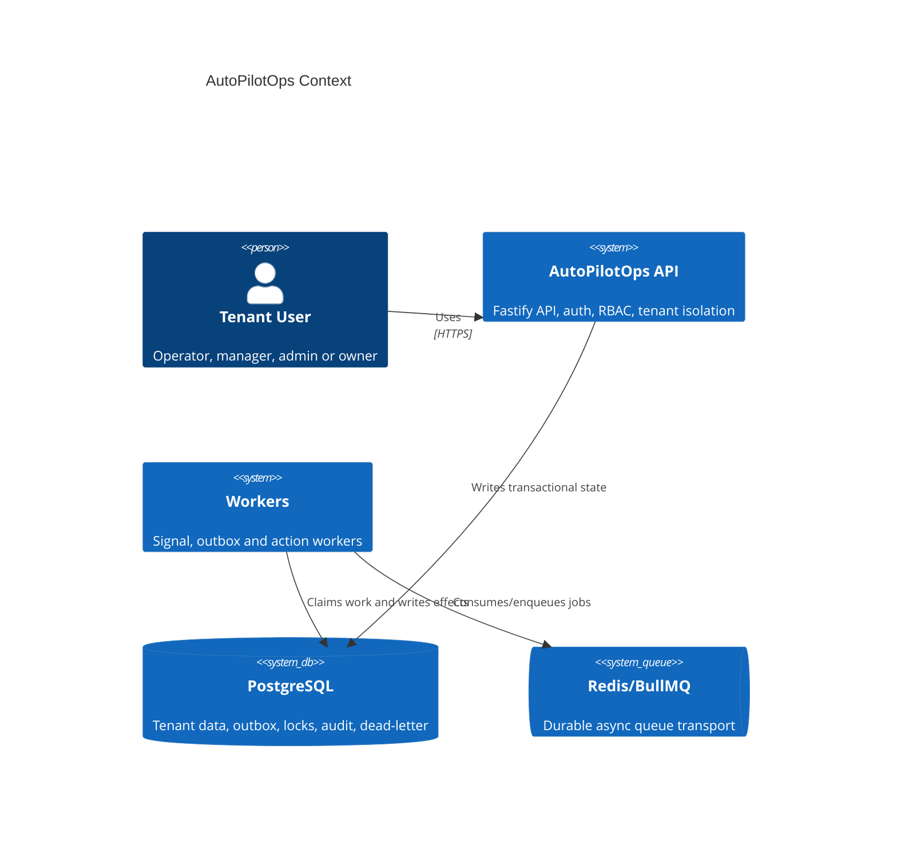
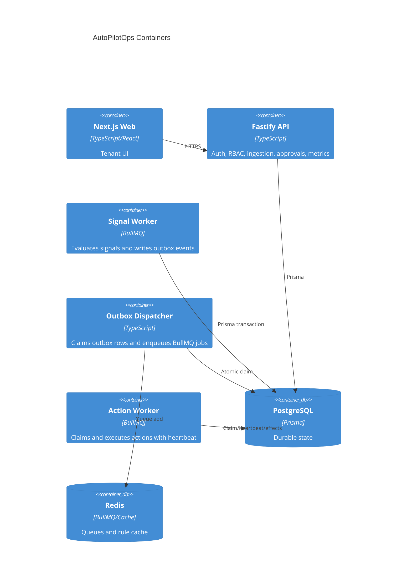
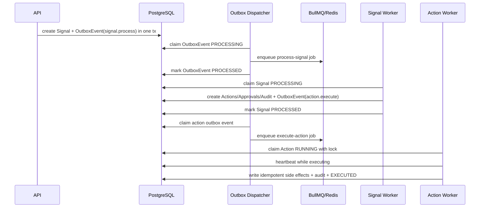
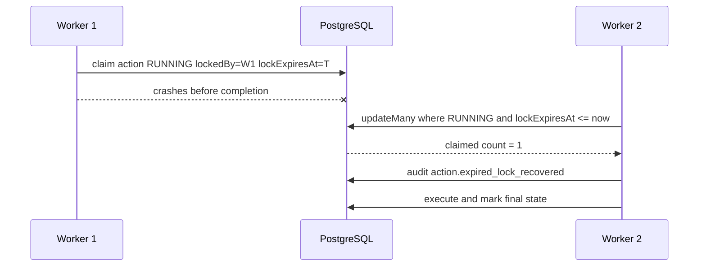
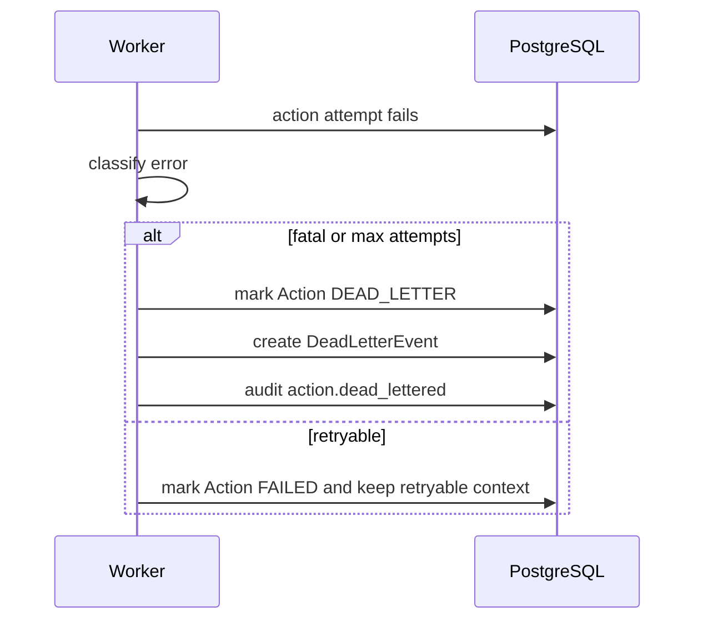

# AutoPilotOps Architecture

AutoPilotOps is structured as a SaaS backend with clear separation between API, worker, shared contracts, web UI and infrastructure.

```txt
apps/api         Fastify API, auth, RBAC, routes, engines, queues, workers
apps/web         Next.js UI using typed API client
packages/shared  Shared TypeScript contracts and role helpers
prisma           Data model, migrations and seed
infra            Docker Compose and Dockerfiles
```

## Core pipeline

```txt
Signal Ingestion API
  -> OutboxEvent(signal.process) in same DB transaction
  -> Outbox dispatcher
  -> BullMQ signal-processing job
  -> Signal worker claims PROCESSING
  -> Correlation engine
  -> Rule engine
  -> Policy engine
  -> Action / ApprovalRequest writes
  -> OutboxEvent(action.execute) for executable actions
  -> Signal marked PROCESSED only after all durable effects exist
  -> Outbox dispatcher
  -> BullMQ action-execution job
  -> Action worker atomic claim + expiring lock
  -> Idempotent side-effect materialization
  -> Audit log / read models / DeadLetterEvent when exhausted
```

## Domain boundaries

- `correlation.engine.ts`: deterministic interpretation of raw signal payloads.
- `rule.engine.ts`: configurable playbook matching from database rules. It accepts an optional Prisma transaction client so rule executions can be written atomically with signal processing.
- `policy.engine.ts`: execution mode selection based on risk and tenant policy.
- `action.engine.ts`: action lock claim, idempotent side-effect materialization, retry state and action dead-lettering.
- `signal.worker.ts`: signal orchestration. It does not enqueue action jobs directly; it writes outbox events in the same transaction as actions/approvals.
- `outbox.dispatcher.ts`: publishes durable outbox records to BullMQ and marks them processed, failed or dead-lettered.
- Routes validate input, enforce RBAC and delegate business behavior to engines.

## Multi-tenancy

Every protected route derives `tenantId` from the authenticated JWT and validates membership. Resource queries use `tenantId` in the `where` clause. Unique constraints include tenant scope for business keys such as signal idempotency, action dedupe keys and outbox dedupe keys.

`/metrics` is tenant-scoped. `ADMIN` and `OWNER` see only their tenant counters. There is no platform-wide metric endpoint unless a future `PLATFORM_ADMIN` role is introduced with explicit product requirements.

## Idempotency

- Signals use `tenantId + idempotencyKey`.
- Signal outbox events use `tenantId + type + dedupeKey`.
- BullMQ signal jobs use `jobId = signal:{signalId}`.
- Rule executions use `tenantId + ruleId + signalId`.
- Actions use `tenantId + dedupeKey`.
- Action outbox events use a deterministic dedupe key for system retries and a request-scoped key for manual retries.
- Incidents, tasks, recommendations and notifications are unique per action.
- Approval requests are unique per action.
- Dead-letter records use `tenantId + sourceType + sourceId`.

## Transactional outbox

The API and workers never rely on “database write then direct BullMQ enqueue” for critical workflow transitions. Instead they save `OutboxEvent` rows inside the same Prisma transaction as the domain changes. A dispatcher later publishes those events to BullMQ and only then marks the event `PROCESSED`.

This prevents three production failure classes:

1. Database commit succeeds but BullMQ enqueue fails.
2. BullMQ enqueue succeeds but the database transaction rolls back.
3. The process crashes between the domain write and the queue operation.

## Action locks and recovery

Actions carry `lockedAt`, `lockedBy`, `heartbeatAt` and `lockExpiresAt`. The action worker claims work atomically by updating eligible rows to `RUNNING` with a lock expiry and an incremented `attemptCount`.

A `RUNNING` action with an expired lock can be reclaimed by another worker. The reclaim is audited as `action.expired_lock_recovered`. Actions that exceed `maxAttempts` move to `DEAD_LETTER` with a durable `DeadLetterEvent`.

## Retry and dead-letter strategy

BullMQ still performs short-term retries and backoff, but it is not the system of record for dead letters. Durable failure state is stored in PostgreSQL:

- `Action.status = DEAD_LETTER` for final action failures.
- `DeadLetterEvent` records source type, source id, payload, attempts and final reason.
- `OutboxEvent.status = DEAD_LETTER` when dispatch to BullMQ repeatedly fails.
- Admin endpoints list and reprocess dead-letter events.

## Observability

The API emits structured logs through Fastify/Pino. Responses include `x-request-id`. Audit logs persist `requestId`, `correlationId`, `actor`, `event`, `resourceType` and metadata. `/health/live`, `/health/ready` and tenant-scoped `/metrics` are available.

## Round 2 hardening architecture

### C4 Context



### C4 Container



### Main sequence



### Stale action recovery



### Dead-letter flow


